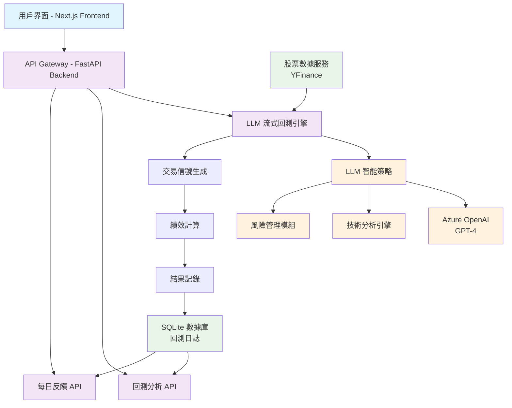
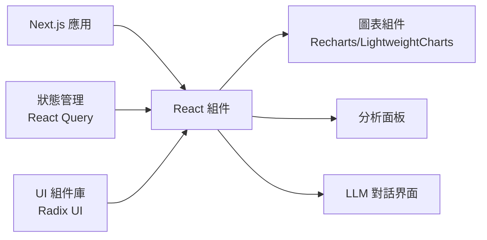
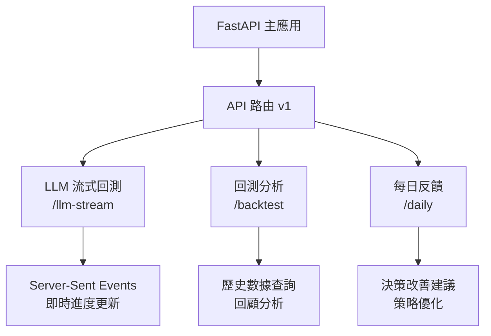
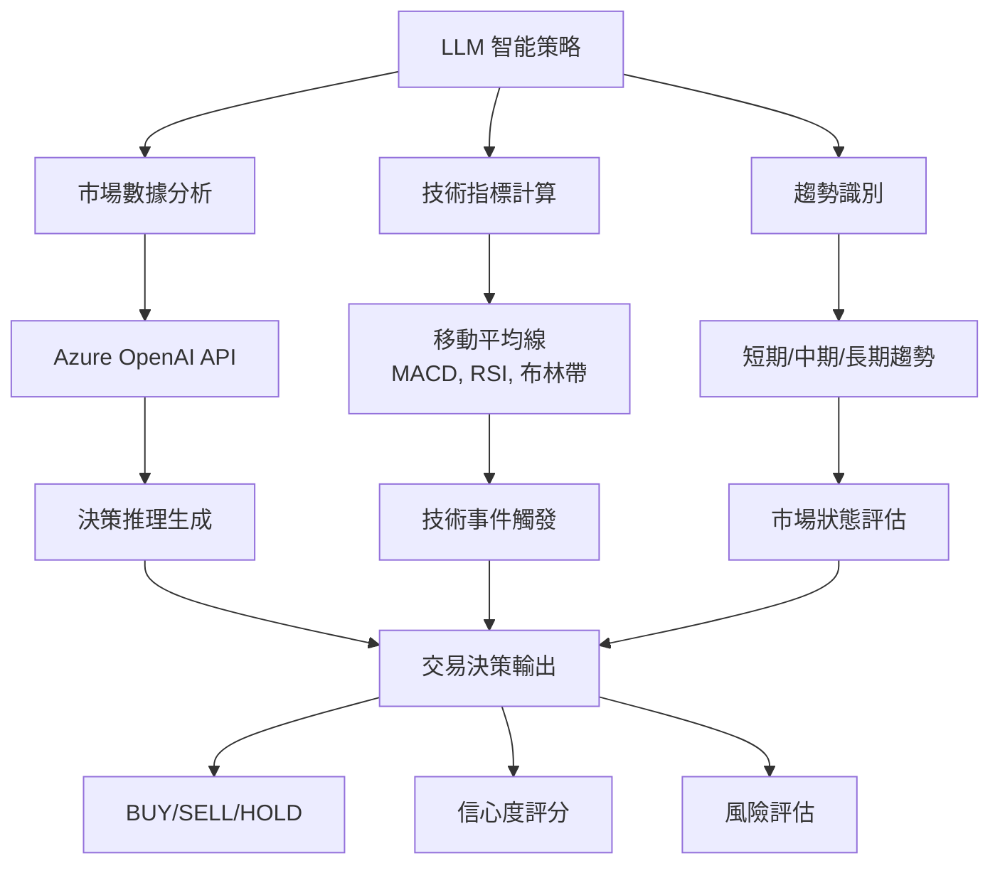
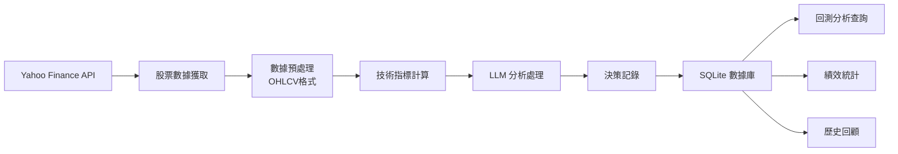
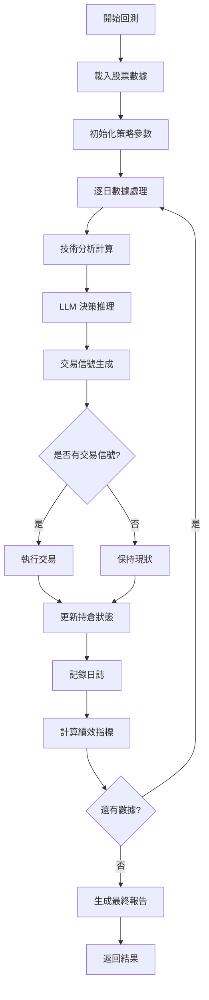

# LLM Agent Trader 系統架構設計

## 系統概述
LLM Agent Trader 是一個基於人工智慧的股票交易回測系統，整合了大語言模型(LLM)進行智能交易決策分析。

## 高層次系統流程圖

## 核心概念說明

### LLM 流式回測引擎 vs 回測引擎
- **LLM 流式回測引擎**: 是整個回測系統的協調層，負責：
  - 接收前端請求並初始化回測流程
  - 使用 Server-Sent Events 提供即時進度更新
  - 協調數據獲取、策略執行、結果處理等各個環節
  - 管理回測會話和狀態

- **回測引擎**: 是核心計算引擎，專注於：
  - 執行具體的回測邏輯和交易模擬
  - 處理 LLM 策略產生的交易信號
  - 計算績效指標和風險指標
  - 維護持倉狀態和資金管理

簡單來說，**流式回測引擎**是整個系統的"指揮官"，而**回測引擎**是執行具體計算的"執行者"。

## 詳細系統架構

### 1. 前端層 (Frontend)

### 2. 後端 API 層

### 3. LLM 策略引擎

### 4. 數據流程

### 5. 回測執行流程

## 核心功能模組

### 1. LLM 決策引擎
- **輸入**: 市場數據、技術指標、歷史趨勢
- **處理**: Azure OpenAI GPT-4 推理分析
- **輸出**: 交易決策、信心度、推理過程

### 2. 技術分析模組
- **移動平均線**: SMA, EMA 交叉策略
- **動量指標**: RSI, MACD 信號
- **波動性指標**: 布林帶突破
- **趨勢識別**: 多時間框架分析

### 3. 風險管理
- **停損機制**: 固定比例停損
- **停利設定**: 目標利潤鎖定
- **倉位控制**: 最大持倉比例限制
- **資金管理**: 動態資金分配

### 4. 數據持久化
- **SQLite 數據庫**: 輕量級本地存儲
- **日誌記錄**: 每日交易決策和分析
- **績效追蹤**: 累積收益和風險指標
- **事件記錄**: 技術事件和觸發條件

## 技術棧

### 前端技術
- **框架**: Next.js 15.4.4 (React 19)
- **樣式**: Tailwind CSS 4.0
- **圖表**: Recharts, Lightweight Charts
- **狀態管理**: TanStack React Query
- **UI 組件**: Radix UI

### 後端技術
- **API 框架**: FastAPI (Python)
- **數據庫**: SQLite
- **LLM 集成**: Azure OpenAI API
- **數據源**: Yahoo Finance (yfinance)

### 開發和運維
- **開發環境**: Python 虛擬環境 + Node.js
- **版本控制**: Git
- **依賴管理**: uv (Python), npm (Node.js)

## 系統特色

1. **即時流式回測**: 使用 Server-Sent Events 提供即時進度更新
2. **智能決策分析**: 整合 GPT-4 進行深度市場分析
3. **互動式反饋**: 支持用戶對歷史決策提供反饋和改善建議
4. **全面技術分析**: 多維度技術指標和趨勢識別
5. **歷史數據分析**: 支持複雜的回測數據查詢和回顧分析

## 擴展性設計

- **模組化架構**: 各功能模組獨立，易於擴展
- **API 版本控制**: 支持多版本 API 並存
- **策略插件化**: 支持多種交易策略並行
- **多數據源**: 可擴展支持更多金融數據提供商
- **部署靈活性**: 支持本地開發和雲端部署